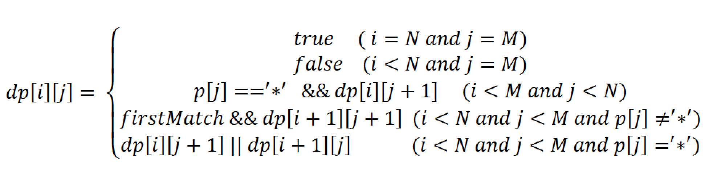

# 40. Wildcard Matching (Difficult)
 
## Description
Given an input string (s) and a pattern (p), implement wildcard pattern matching with support for `'?'` and `'*'`.

```
'?' Matches any single character.
'*' Matches any sequence of characters (including the empty sequence).
```
The matching should cover the **entire** input string (not partial).

link: https://leetcode.com/problems/wildcard-matching/
## Analysis
This problem is quite similar to [10. Regular Expression](https://github.com/WingCuengRay/Leetcode_solution/blob/master/docs/notes/10_Regular_Expression_Matching.md). The only difference 
is that `'*'` matches zero or more of the preceding character in problem 10, which means `'*'` cannot be the first element in th pattern.
However, in this problem, `'*'` is used to match any sequence of characters. As a result,  we need to have a mechanism to "memorize" the preceding
character of `'*'` in problem 10, while we needn't in this problem.
 
### Basic idea
The idea here is pretty similar with Problem 10.

The easiest way to solve the problem is using recursion. For `s[0...N-1]` and `p[0...M-1]`, we can simply check if
`s[0] == p[0]` (`'?'` can match anything ), and then check if `s[1...N-1]` matches `p[1...M-1]`.

## Cases
### Base case
1. If the string and the pattern are both empty, they matches.
2. If the string is not empty and the pattern is empty, they must not match.
3. If the string is empty and the pattern is not empty, they may or may not match. (ex. string: `""` and pattern: `"***"`) 

### Derived case
Let's say the string is `s[i...N-1]` and the pattern is `p[j..M-1]`. The problem to check if they match can be separated into
two problems if there is no `'*` in the pattern. The result of the problem is true only if the results of two sub-problem are true.
1. if `s[i]` match `p[j]` 
2. if `s[i+1...N-1]` match `p[j+1...M-1]`

However, things become a little complicated if `'*'` involves. Since it can match any sequence (including empty sequence),
we need to check if current character of the pattern is '`*'` or not. If it's `'*'` , the result would be comprised by 
two sub-problem: 
1. if `s[i...N-1]` match `p[j+1...M-1]` 
2. if `s[i+1...N-1]` match `p[j...M-1]`
The first sub-problem means we don't use `'*'` to match any character in the string. The second one means we use it to match 
the current character of the string (which is `s[i]`)

### First Approach - Recursion
In my opinion, if you can't apply DP immediately, you can use recursion to help you clear your mind. Then you can improve it
with dynamic programming.

Here is the pseudocode of the recursive algorithm. However, the worse case time complexity of this recursion algorithm is
horrible. The worse case happens when all the characters in the pattern are `'*'`. Accroding to the pseudocode below,
we can get the recursive equation of worse case: `T[s(n), p(m)] = T(s[n-1], p[m]) + T(s[n], p[m-1])`. The time complexity
is `O(2^(m+n))`, where `n` is the length of the string and `m` is the length of the pattern. That's why
there will be **Time Limit Exceeded** error when you submit it to Leetcode.

```
isMatch(s[i...N-1], p[j...M-1]):
    if s is empty and p is empty:
        return true
    if s is not empty and p is empty:
        return false
    
    if p[j] == '*':
        result = isMatch(s[i...N-1], p[j+1...M-1])
        if s is not empty:
            result = result or isMatch(i+1...N-1], p[j...M-1])
        return result
    else:
        if s is not empty and (p[j] == '?' || p[j] == s[i]):        
            return isMatch(s[i+1...N-1], p[j+1...M-1])
        else
            return false;
```

Here is the java implementation of the pseudocode above.
```java
public class WildcardMatching {
    public boolean isMatch(String s, String p) {
        if(p.isEmpty()){
            return s.isEmpty();
        }

        if(p.charAt(0) == '*'){
            return isMatch(s, p.substring(1)) || (!s.isEmpty() && isMatch(s.substring(1), p));
        }
        else {
            boolean firstMatch = !s.isEmpty() &&
                (p.charAt(0) == '?' || s.charAt(0) == p.charAt(0));
            return firstMatch && isMatch(s.substring(1), p.substring(1));
        }
    }
}
```

### Second Approach - Dynamic Programming
Actually, we can easily figure out the recursive equation according to the idea above. Here is the
equation I get.



The first two cases are base cases and the last three cases are derived cases. One mistake I made when implementing
my DP algorithm is that I miss the third case. If the string is empty and the pattern is not, they can still match, 
(ex. string: `""` and pattern: `"****"`). 

Here is my DP implementation based on the equation. The tiem complexity of the algorithm is `O(MN)`, 
where N and M is the length of string and pattern. 
```java
public class WildcardMatching {
    public boolean isMatch(String s, String p){
        boolean dp[][] = new boolean[s.length()+1][p.length()+1];

        for(int i=s.length(); i>=0; i--){
            for(int j=p.length(); j>=0; j--){
                if(i == s.length() && j == p.length())
                    dp[i][j] = true;
                else if(i == s.length() && j < p.length())
                    dp[i][j] = p.charAt(j) == '*'? dp[i][j+1] : false;
                else if(i < s.length() && j == p.length())
                    dp[i][j] = false;
                else {
                    // the case when i < s.length && j < p.length()
                    boolean firstMatch = p.charAt(j)=='?' || s.charAt(i)==p.charAt(j);
                    if(p.charAt(j) == '*')
                        dp[i][j] = dp[i][j+1] || dp[i+1][j];
                    else
                        dp[i][j] = firstMatch && dp[i+1][j+1];
                }
            }
        }

        return dp[0][0];
    }
}
```

### Third approach
The third approach is based on tricky string comparision, inspired by the fastest leetcode solution
of this problem.

The idea is to have two extra index - `nextI` and `nextJ` for trace-back. Those two index is firstly set when
there is a '*'. It's because only when `*` occurs we need to trace back since it can match zero or more of any characters.

`nextI` is set to the next character that can be matched by '*' in string and `nextJ` is set to the next character of `*`. 
A trace-back will happen only if `s[i]` and `p[j]` don't match. Each trace-back will increment `nextI` and reset `j`
to the next character of `*` which is `nextJ`. It means `*` matches one more character and the subsequent 
match will start after this character in the string.

If every character of `s` has been matched, then we need to check if there is any character that is not matched in `p`. We can 
skip tailing `*` in the pattern. It means the string and pattern don't match If there is still character remained unmatched in `p`.

The worse-case time complexity of the approach is `O(MN)` (M is length of string and N is length of pattern). 
It happens when string and pattern have long common prefix and greatly different length, and `*` involves. It will cause comparision of every character 
in `p` in each trace-back, and trace-back will happens `M - N` times since their length varies greatly. 

A worse case example is "aaaaaaaaaaaaa" and "*aab".

```java
public class WildcardMatching {
    public boolean isMatch(String s, String p){
        int i = 0;
        int j = 0;
        int nextI = -1;              // the index of char to track back if something doesn't match
        int nextJ = -1;              // the index of char after a '*', for trace-back if something doesn't match

        while(i < s.length()){
            if(j < p.length() && (p.charAt(j)=='?' || s.charAt(i) == p.charAt(j)) ){
                i++;
                j++;
            } else if (j < p.length() && p.charAt(j) == '*'){
                nextI = i+1;
                nextJ = ++j;
            } else if(nextI != -1) {            // a mismatch happens, then trace back if a '*' happens before.
                // trace back
                i = nextI++;
                j = nextJ;              // let j trace back to be the next character of '*'
            } else
                return false;           // No '*' occurs before a mismatch happens
        }

        while (j < p.length() && p.charAt(j) == '*')
            j++;                        // skip tailing '*'

        return j == p.length();         // return true if everything in pattern has been matched, false otherwise.
    }
}
```