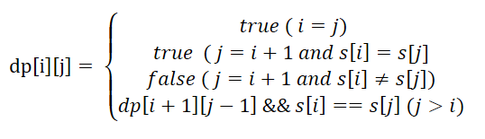
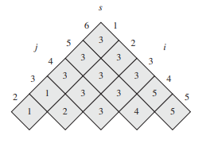

# 5. Longest Palindromic Substring
 
## Description
Given a string s, find the longest palindromic substring in s. You may assume that the maximum length of s is 1000.

Example 1:
```
Input: "babad"
Output: "bab"
Note: "aba" is also a valid answer.
```

Example 2:
```
Input: "cbbd"
Output: "bb"
```

link: https://leetcode.com/problems/longest-palindromic-substring/
## Analysis
After reading the problem description, the approach of Expand Center and Dynamic Programming came out of my mine. Although those two approaches are feasible for the problem, I was unable to solve 
the problem with them since there is something I can't figure out, in both DP and Expand Center.

### Expand Center
Palindromic is a kind of strings which are the same no matter you read forward or backward. For example, `abcdcba` is a palindromic but `abcdefg` is not. To find a palindromic, the most 
straightforward way is to find the center of a string and expand the string on both left and right side. If the character on the left side is the same with the one on 
the right side, we expand the palindromic and keep checking the next left/right character. 

Based on the idea above, we can iterate all the characters in `s`, make each character as a center and expand. We keep rercording the length of the palindromic of each center and return the longest one.
However, there is a situation I missed - **the center could be between two characters**. For example, the center of string `bb` is between the first and the second letter b, which is a virtual center.
That's the reason why I can't get my first solution passed.

This situation can be easily solved if we add a virtual center between each each character in the string. As a result, we got `n-1` virtual centers between characters and `n` centers on each character.
Then we can expand each center, compare the length of palindromic on each center and get the longest one. We have `2n-1` centers and each expand operation need `O(n)` at worse case, which give us `O(n^2)`
time complexity on Expand Center approach. The space complexity is `O(1)`.

### Dynamic Programming
The second approach is based on dynamic programming. Firstly, we need to find the **optimal sub-problem** in the problem. Given `s[i..j]` (j>>i), whether it's a palindromic depends on if `s[i+1...j-i]` is a 
palindromic and if `s[i]` equals to `s[j]`. We can also find many **overlapped sub-problem**. For example, the problem `s[i+2...j-2]` is a sub-problem of both `s[i+1...j-1]` and `s[i...j]`.

Then we need to find the base cases of the problem.
1. if there is only one character in the string, it must be a palindromic with length 1.
2. if there is two character in the string, it is a palindromic with length 2 if and only if the two characters are the same.

We don't need to deal with the case when `j < i` since it's meaningless.

As a result, we can get the recursive equation as below. 



The time complexity of DP approach is `O(n^2)`. The space complexity is `O(n^2)` as well, but it could be improved to `O(n)`. Please see the next section for detail.

## Solution
### First approach - Expand Center
```java
public class LongestPalindromicSubstring {
    /**
     * First Approach: Expand center
     *
     * Time complexity: O(n^2)
     * Space complexity: O(1)
     */
    public String longestPalindrome(String s) {
        String result = "";
        int longest = 0;

        for(int i=0; i<s.length(); i++){
            String substr1 = longestPalindrome(s, i, i);
            String substr2 = longestPalindrome(s, i, i+1);

            if(substr1.length() > longest) {
                longest = substr1.length() ;
                result = substr1;
            }
            if(substr2.length() > longest) {
                longest = substr2.length();
                result = substr2;
            }
        }

        return result;
    }

    private String longestPalindrome(String s, int left, int right) {
        while(left>=0 && right<s.length()){
            if(s.charAt(left) != s.charAt(right))
                break;
            left--;
            right++;
        }

        if(right == left+1)
            return "";

        return s.substring(left+1, right);
    }
}
```

### Second approach - Dynamic Programming
There is one thing that need to be noticed when filling the dp matrix. Instead of filling the matrix row by row or column by column, we fill it diagonally. You can rotate the table so that 
the main diagonal runs horizontally. The rotated table is like the below one (Ignore the value inside. The picture is from CLRS). Firstly we fill the main diagonal (which is always true in the problem),
and then we fill the second diagonal and so on.


#### With `O(n^2)` space complexity
```java
public class LongestPalindromicSubstring {
        /**
     * Second approach: Dynamic Programming
     *
     * Time complexity: O(n^2)
     * Space complexity: O(n^2)
     */
    public String longestPalindrome_DP(String s){
        boolean dp[][] = new boolean[s.length()][s.length()];

        int maxLen = 0;
        int start = 0;
        int end = 0;
        for(int k=0; k<s.length(); k++){
            for(int i=0; i+k<s.length(); i++) {
                int j = i + k;

                if(i == j)
                    dp[i][j] = true;
                else if(j == i+1){
                    if(s.charAt(i) == s.charAt(j))
                        dp[i][j] = true;
                    else
                        dp[i][j] = false;
                }
                else
                    dp[i][j] = dp[i+1][j-1] && s.charAt(i) == s.charAt(j);

                if(dp[i][j] == true && j-i+1 > maxLen){
                    maxLen = j-i+1;
                    start = i;
                    end = j;
                }
            }
        }

        if(maxLen == 0)
            return "";
        else
            return s.substring(start, end+1);
     }
}
```

#### With `O(n)` space complexity
```java
public class LongestPalindromicSubstring {
        /**
     * Second approach: Dynamic Programming
     *
     * Time complexity: O(n^2)
     * Space complexity: O(n^2)
     */
    /**
     * Third approach: DP with linear time complexity
     *
     * Time complexity: O(n^2)
     * Space complexity: O(n)
     */
    public String longestPalindrome_DP_optimal(String s){
        boolean last[] = new boolean[s.length()];
        boolean lastLast[] = new boolean[s.length()];
        boolean cur[] = new boolean[s.length()];

        int maxLen = 0;
        int start = 0;
        int end = 0;
        for(int k=0; k<s.length(); k++){
            for(int i=0; i+k<s.length(); i++){
                int j = i+k;
                if(i == j)
                    cur[j] = true;
                else if(j == i+1 && s.charAt(i) == s.charAt(j))
                    cur[j] = true;
                else if(j == i+1 && s.charAt(i) != s.charAt(j))
                    cur[j] = false;
                else
                    cur[j] = lastLast[j-1] && s.charAt(i) == s.charAt(j);

                if(cur[j] == true && j-i+1 > maxLen){
                    maxLen = j-i+1;
                    start = i;
                    end = j;
                }
            }

            boolean tmp[] = last;
            last = lastLast;
            lastLast = tmp;

            tmp = last;
            last = cur;
            cur = tmp;
        }

        if(maxLen == 0)
            return "";
        else
            return s.substring(start, end+1);
    }
}
```


## Reference
1. https://leetcode.com/problems/longest-palindromic-substring/solution/
2. "Introduction to Algorithms, Third Edition". www.cs.dartmouth.edu.