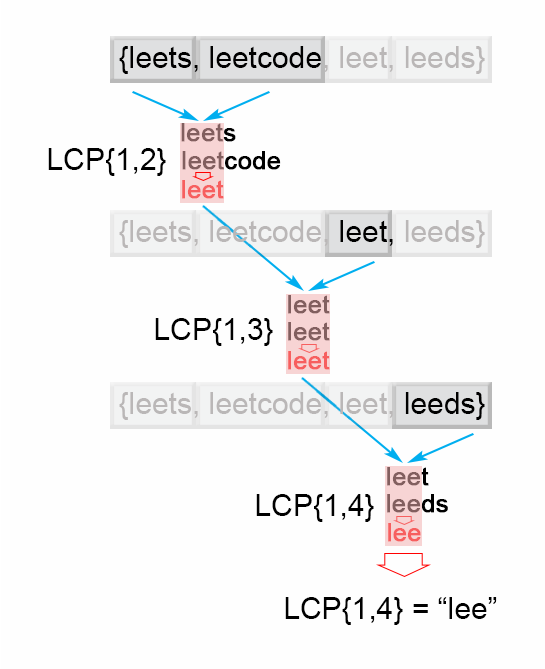

# 14. Longest_Common_Prefix (Easy)
 
## Description
Write a function to find the longest common prefix string amongst an array of strings.

If there is no common prefix, return an empty string "".

Example 1:
```
Input: ["flower","flow","flight"]
Output: "fl"
```

link: https://leetcode.com/problems/longest-common-prefix/
## Analysis
### Base case
1. If there are no string in the array, `""` is returned.
2. If any of the string in the list is `""`, `""` is returned.
3. If there is only one string in the array, the string is returned.

### First Approach - vertical matching
It's an easy problem. The first idea that came out of my mind is get the `nth` character of each
string one by one, and then check if they are equal. If they're the same, keep checking the
next character, or return the substring prefix otherwise.

```java
public class LongestCommonPrefix {
    public String longestCommonPrefix(String[] strs) {
        if(strs.length == 0)
            return "";
        else if(strs.length == 1)       // return itself if there is only one string
            return strs[0];

        for(String str: strs){
            if(str.isEmpty())
                return "";
        }

        int i = 0;

        outerloop:
        while(true){
            if(i >= strs[0].length())
                break;
            char ch = strs[0].charAt(i);
            for(String str : strs){
                if(i>=str.length() || str.charAt(i) != ch)
                    break outerloop;
            }
            i++;
        }

        return strs[0].substring(0, i);
    }
}
```

### Second Approach (inspired by leetcode solution)
If we analyze the problem carefully, we can find that there is a also sub-problem structure.
`LCP([s_i, s_i+1, ... s_n]) = LCP(s_i, LCP([s_i+1, s_i+2, ... s_n]) ) = LCP(s_n, LCP([s_i, s_i+1, ... s_n-1]) )`.

Actually it can be seen as a very simple dynamic programming problem with optimal sub-problem structure
but without overlapped sub-problem.

We can do it iteratively, getting the common longest prefix from left to right (horizaontal matching).




```java
public class LongestCommonPrefix {
    public String longestCommonPrefix(String[] strs){
        if(strs.length == 0)
            return "";
        else if(strs.length == 1)
            return strs[0];

        String commonPrefix = strs[0];
        for(int i=1; i<strs.length; i++){
            commonPrefix = longestCommonPrefix(commonPrefix, strs[i]);
            if(commonPrefix.isEmpty())
                return "";
        }

        return commonPrefix;
    }

    private String longestCommonPrefix(String str1, String str2){
        int i;
        for(i=0; i<str1.length() && i< str2.length(); i++){
            if(str1.charAt(i) != str2.charAt(i))
                break;
        }

        return str1.substring(0, i);
    }
}
```

PS: We can also change the split ratio. For example, 
`LCP([s_i, s_i+1, ... s_n]) = LCP(LCP([s_i...s_(i+n)/2]),  LCP([s_(i+n)/2...s_n]) )`.
In this way, we can divide the problem into two equal-size sub-problem. 
 
 
## Follow-up problem
> Given a set of keys S = [S1, S2, ... Sn], find the longest common prefix among a string q and S. This LCP query will be called frequently.

With trie.


## Reference
1. https://leetcode.com/problems/longest-common-prefix/solution/ 
2. https://leetcode.com/articles/implement-trie-prefix-tree/
