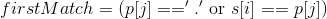
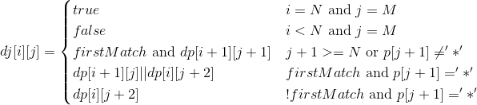

# 10. Regular Expression Matching (Difficult)
 
## Description
Given an input string (s) and a pattern (p), implement regular expression matching with support for `'.'` and `'*'`.

```
'.' Matches any single character.
'*' Matches zero or more of the preceding element.
```

link: https://leetcode.com/problems/regular-expression-matching/


## Analysis
It's a problem about string matching. What should be notice is the two special characters `'.'` and `'*'`. If only 
the character `'.'` is involved, the problem can be solved easily. The character `'.'` can match any other characters and 
the length of the string and the pattern must be equal. 

However, when the `'*'` comes in, the difficult stuff occurs. The length of string and pattern can be different
 since `'*'` can match **zero or more** of the preceding element. 
 
 
### Basic idea
 The easiest way to solve the problem is using recursion. For `s[0...N-1]` and `p[0...M-1]`, we can simply check if
 `s[0] == p[0]` (`'.'` can match anything ), and then check if `s[1...N-1]` matches `s[1...M-1]`.
 
### Special ase
However, there are some special cases we need to deal with when there is a `'*'`. Take `"aa"` and `"a*"` as an example. 
The character `'*'` can repeat the preceding character. In other word, **the current character may be repeated if the next 
character is `'*'`**. As a result, we need to check the next character in `p` to see if the current character can be 
repeated. 

On the other hand, **the current character can also be eliminated by the following `'*'`**, ex. `"aa"` and `"s*aa"`.
This case is corresponding to the requirement **zero of preceding elements**, also preventing the greedy matching of `'*'`.

PS: For the greedy matching, take `"aaa"` and `"a*a"` as an example. `"a*"` will match the whole `"aaa"` if `"*"` do 
the greedy matching, thus the tailing `a` in pattern could not be matched.

### Base case
1. If the string and the pattern are both empty, they must match.
2. If the string is not empty and the pattern is empty, they must not match.

It's easy to understand the both two base cases. However, if the string is empty and the pattern is not empty, they may 
or may not match. Consider the two example: `""`(s) and `"s*"`(p),  `""`(s) and `"ss"`(p). The former one matches while 
the latter one doesn't. 

## Pseudocode
```
// Result is generated by isMatch(s[0...N-1], p[0...M-1])
isMatch(s[i...N-1], p[j...M-1]):
  if p is empty and s is empty:   // base case 1
    return true
  if p is empty and s is not empty: // base case 2
    return false
  
  if p[j+1] doesn't exist or p[j+1] != '*':     // SP1
    // "s[i] matches p[j]" also check if p[j] == "." 
    if s[i] matches p[j]:                                 
      return isMatch(s[i+1...N-1], p[j+1...M-1]) 
    else
      return false                              
  else:     // special case: p[j+1] exists and p[j+1] == '*'                            // SP2
    if s[i] matches p[j]:     
      return isMatch(s[i+1...N-1], p[j...M-1]) or isMatch(s[i...N-1], p[j+2...M-1])     // SP2_1
    else
      return isMatch(s[i...N-1], p[j+2...M-1])                                          // SP2_2
```

We have two cases SP1 and SP2. SP1 is the basic solution without the `'*'` involved. 

SP2 involves `'*'`. A following star can eliminate or repeat the current character. If the current character of `s` and `p`
don't match, the case of elimination must occur, which is case SP2_2. `p[j+2..M-1]` means the character and the `'*'` in 
the pattern are skipped.

If the current character of `s` and `p` matches, the `'*'` can keep matching the next character on `s` 
or it can be skipped, which is case SP2_1.

## Solution
### First approach - brute force recursion
Here is the java implementation of the pseudocode above. This solution make use of brute force recursion to solve the 
problem. Although the solution is not optimal, it's an essential path to the optimal. 
```java
class RegularExpressionMatching{
    public boolean isMatch(String s, String p){
        if(p.isEmpty()) {
            return s.isEmpty();
        }

        boolean firstMatch = !s.isEmpty() && (p.charAt(0)=='.' || s.charAt(0) == p.charAt(0));

        if(p.length() >= 2 && p.charAt(1) == '*'){
            // There are two situations if '*' occurs. ex. "aaa" and "a*a"
            // 1. 'a*' can be seen as one ore more characters of 'a', which should only be used if first character of both string matches.
            // 2. 'a*' can be seen as empty string, which should be used no matter firstMatch is true or false.
            return isMatch(s, p.substring(2)) || (firstMatch && isMatch(s.substring(1), p));
        } else {
            return firstMatch && isMatch(s.substring(1), p.substring(1));
        }
    }
}
```

### Second approach - dynamic programming
If we look at the brute force approach carefully, we can see `isMatch(s[i...n], p[j...m])` is a sub-problem of the original problem, and
it's invoked many times with each time returning the same result.

Then we have the two key elements of dynamic programming -- optimal sub-problem and overlapped sub-problem. We could use dynamic programming
to solve the problem. The first thing we need to do is to figure out the recursive formula.





```java
class RegularExpressionMatching{
    public boolean isMatch(String s, String p){
        boolean dp[][] = new boolean[s.length()+1][p.length()+1];
        dp[s.length()][p.length()] = true;
        for(int i=0; i<=s.length()-1; i++)
            dp[i][p.length()] = false;

        for(int i=s.length(); i>=0; i--){
            for(int j=p.length()-1; j>=0; j--){
                boolean firstMatch = i<s.length() && (p.charAt(j) == '.' || s.charAt(i) == p.charAt(j));
                if(j+1==p.length() || p.charAt(j+1)!='*')
                    dp[i][j] = firstMatch && dp[i+1][j+1];
                else if(j+1<p.length() && p.charAt(j+1)=='*'){
                    if(firstMatch)
                        dp[i][j] =  dp[i+1][j] || dp[i][j+2];
                    else
                        dp[i][j] = dp[i][j+2];
                }
            }
        }

        return dp[0][0];
    }
}
```


## Conclusion